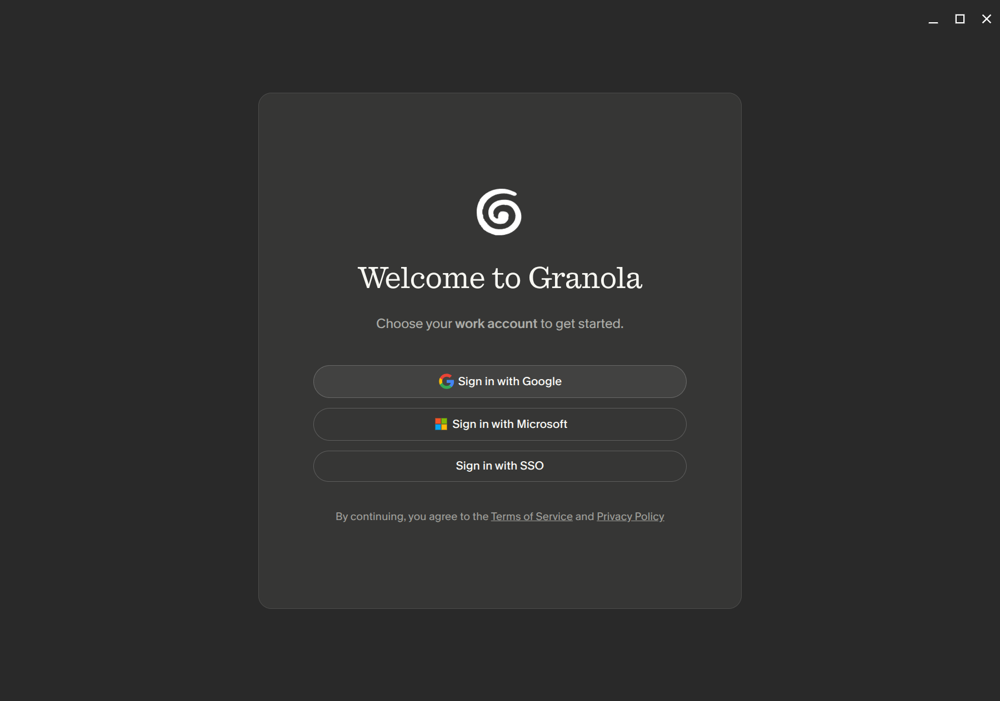

# Granola on Linux

[Granola](https://www.granola.ai) only ships for macOS and Windows. It is an Electron app though, so the macOS `.dmg` already holds all of the app's JavaScript, which runs anywhere. It is just attached to a macOS runtime. This repo swaps in the Linux runtime and fixes what breaks. You get a real Linux app. No Wine, no VM, no emulation.



## Run it

1. Download the `.dmg` from [granola.ai/download](https://www.granola.ai/download)
2. Install what you need: `sudo apt install g++-11 nodejs npm python3 curl make`
3. Run `./granola-linux.sh "Granola - AI Notepad.dmg"`
4. Open Granola from your app menu and sign in

That is it. The script installs to `~/Applications/granola`, adds a desktop entry, registers the `granola://` sign-in handler, and tests the build before it tells you it worked. Run `./uninstall.sh` to undo it.

Set `INSTALL_DIR=` to install somewhere else. You need x86-64 or aarch64 and g++ 11 or newer. Tested on Pop!\_OS (Ubuntu 20.04 base, glibc 2.32) with Granola 7.452.1 and Electron 42.7.0.

## Run it with Nix

There is a flake, so with Nix installed (any distro, NixOS included) you can skip step 2 entirely:

```
nix run github:portal-wheatley/Granola-for-Linux -- "Granola - AI Notepad.dmg"
```

This brings its own 7zz, Node, Python, and compiler, works on `x86_64-linux` and `aarch64-linux` (the Electron runtime and native build are arch-detected), and wraps the launcher in an FHS environment so the prebuilt Electron binary also runs on NixOS, which has no `/lib64` loader. The install still lands in `~/Applications/granola` with a desktop entry.

One caveat: the generated launcher points at the FHS wrapper in the Nix store. If `nix-collect-garbage` removes it, just run the command above again.

## What works

| | |
|---|---|
| ✅ | Notes, editor, sync, AI features, and search. The core app. |
| ✅ | Sign-in with Google, Microsoft, or SSO |
| ✅ | Encrypted local database that survives restarts |
| ✅ | Microphone recording |
| ✅ | The Granola Companion browser extension, in Chrome, Chromium, Brave, Edge, Vivaldi and Opera installed from a normal package. Flatpak and Snap browsers cannot reach the host program from inside their sandbox. |
| ✅ | System audio, so the other side of a call gets transcribed. The main process records the default output's monitor with `parec` (PulseAudio, or PipeWire's Pulse server) and falls back to `pw-record`. Outside Nix you need one of those installed (`pulseaudio-utils` or `pipewire` on Debian/Ubuntu). Set `GRANOLA_SYSTEM_AUDIO_DEVICE` to record a different PulseAudio source, or `GRANOLA_SYSTEM_AUDIO_COMMAND` to supply your own command that writes mono 16-bit PCM at `{rate}` Hz to stdout. Without a capture tool you get a microphone-only session instead of an error. |
| ❌ | Apple Calendar (EventKit). Google and Microsoft calendars still work, since those run on the server. |
| ❌ | Global hotkeys |
| ❌ | Auto-update. Run the script again with a newer `.dmg`. |

## Build it yourself

If you would rather not run the script, the conversion takes nine steps:

1. Extract the `.dmg` with a modern `7zz`. The `p7zip` in most distros cannot read its LZFSE compression.
2. Read the Electron version out of `Electron Framework.framework/.../Info.plist`, then download that exact Linux build.
3. Unzip the Linux runtime into your install folder and delete `resources/default_app.asar`.
4. Copy `app.asar`, `app.asar.unpacked`, and `icons/` from the bundle into the runtime's `resources/`. Skip every Mac binary, since they all sit behind `darwin` checks.
5. Stub out `electron-click-drag-plugin` if the app bundles it. Newer Granola versions load this macOS-only native addon at startup, but the `.dmg` does not ship its binary, so the main process crashes with "Cannot find module ... drag.node". Replacing its `index.js` means properly repacking `app.asar` while keeping the same files unpacked.
6. While the asar is open, patch two spots in `dist-electron/main/index.js`: teach the browser-extension code the Linux profile directories (`~/.config/google-chrome/NativeMessagingHosts` and friends, it only knows macOS and Windows), and make the microphone permission prompt skip `systemPreferences.askForMediaAccess`, a macOS-only API whose absence leaves the permission request hanging on Linux.
7. Patch the platform string inside `app.asar` so it reports `Windows`. Granola's API returns a 500 error for `platform=linux`, so sign-in fails without this.
8. Rename the `electron` binary to `granola`. Electron sets `app.isPackaged` from the executable name, and with the stock name Granola runs as a development build: it registers `granola-dev://` instead of `granola://`, downloads React devtools on every launch, and looks for its helpers in a source-tree layout.
9. Rebuild `better-sqlite3-multiple-ciphers` from the C++ source inside `app.asar.unpacked` using g++ 11 or newer. Granola's version adds an `updateHook()` that no public build has.

The browser extension also needs a native messaging host at `resources/native-host/meet-consent-host`. The `.dmg` only ships a macOS one. The script installs a small Node program that bridges Chrome's length-prefixed stdio protocol to the newline-delimited JSON Unix socket the app listens on, and the app writes the host manifest into every installed browser's profile the next time it starts.

Most of those steps fail with errors that do not point at the real cause. `granola-linux.sh` has the exact commands, with comments explaining each one.

## Notes

- Nothing here gets around licensing or sign-in. You use your own account and the app talks to Granola's real servers. The only patch is a platform label that their API refuses to accept.
- Granola's code belongs to Granola. Do not commit `app.asar` or the `.dmg`. The `.gitignore` covers both.
- Running the script again is safe. It wipes and rebuilds the install folder and leaves your notes in `~/.config/Granola` alone.
- `./uninstall.sh --purge` also removes the local notes cache and login.
- When launched from the app menu, everything the app prints goes to `~/.local/state/granola/granola.log`. If you see an error popup, the full stack trace is in there. Running `~/Applications/granola/granola.sh` from a terminal prints it instead.
